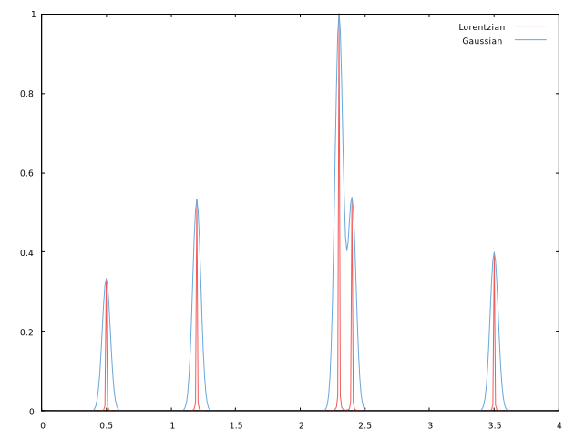
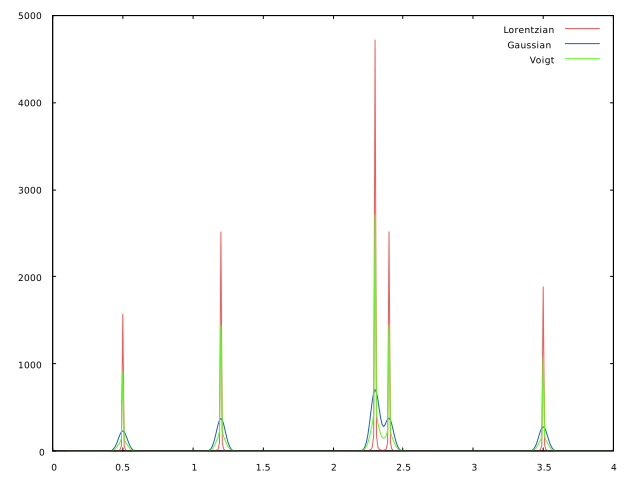

# line profile

スペクトル線形について

Rustで線幅のない信号に線幅を付ける処理を実装する。結果の可視化には`gnuplot`を呼び出すクレートである
[RustGnuplot](https://github.com/SiegeLord/RustGnuplot)を用いる。

## line profile function

ある線幅のない信号 $(x_i, y_i)$ にline shape 関数 $f(\xi)$ によって幅付けられた信号の関数 $\rho(\xi)$ は以下で表現される。  

$$
\rho(\xi) = \sum_{i} y_i f(\xi - x_i)
$$

実際計算する際には $\xi$ は連続ではなく離散的な値であるのでこれを $\xi_j$ として離散的な信号 $\rho(\xi_j)$として考える 

$$
\rho(\xi_j) = \sum_{i} y_i f(\xi_j - x_i)
$$

これは $y_i$ と $f(x_i)$ の畳み込みと見ることができる。代表的なline shape関数には Lorentz関数、Gauss関数がある。

### Lorentz線形

Lorentz関数は蛍光寿命による線幅の広がりを表現するのに用いられる関数で、半値全幅を $\Gamma$ としたとき以下の形で表現される。

$$
L(x) = \frac{\Gamma}{2\pi} \frac{1}{(x - x_{centor})^2 + (\Gamma / 2)^2}
$$

### Gauss線形

Gauss関数はドップラー幅を表現するのに用いられる関数で、半値全幅を $\sigma$ としたとき以下の形で表現される。

$$
G(x) = \frac{\sqrt{\ln(2) / \pi}}{\sigma / 2} \exp\left(-\frac{(x - x_{centor})^2}{\sigma/ 2}\right)
$$

実際に計算したLorentz線形、Gauss線形で線幅を付けてplotしたものを示す。
赤色がLorentz関数によるもので、水色がGauss関数によるものである。どちらも線幅(FWHM)は0.004とした

Fig.1. Lorentz関数、Gauss関数によって幅付けされた信号

### Voigt関数

蛍光寿命による線幅の広がり、ドップラー効果による線幅の広がりの両方を考慮することが必要な場合では２つの関数の畳み込み

$$
V(x: \sigma, \gamma) = \int_{-\infty}^{\infty} dx^{\prime} G(x^{\prime}; \sigma) L(x - x^{\prime}; \gamma) 
$$

によって定義される`voight関数` $V(x: \sigma, \gamma)$ を用いる。
しかし、この積分を解析的に評価することは困難であるので一般的には近似的な方法が用いられる。
一番簡単な方法は適当な重み $\eta$ を付けてLorentz関数、Gauss関数を足し合わせる方法である。

$$
V(x: \sigma, \gamma) = \eta G(x^{\prime}; \sigma) + (1 - \eta) L(x - x^{\prime}; \gamma)  \quad(0 < \eta \le 1) 
$$

実際に計算したLorentz線形、Gauss線形, voigt関数で線幅を付けてplotしたものを示す。
赤色がLorentz関数、水色がGauss関数、黄緑色がvoigt関数によるものである。どちらも線幅(FWHM)は0.004とした。またvoigt関数の $\eta$ は0.5とした

Fig.2. Lorentz関数、Gauss関数, voigt関数によって幅付けされた信号
